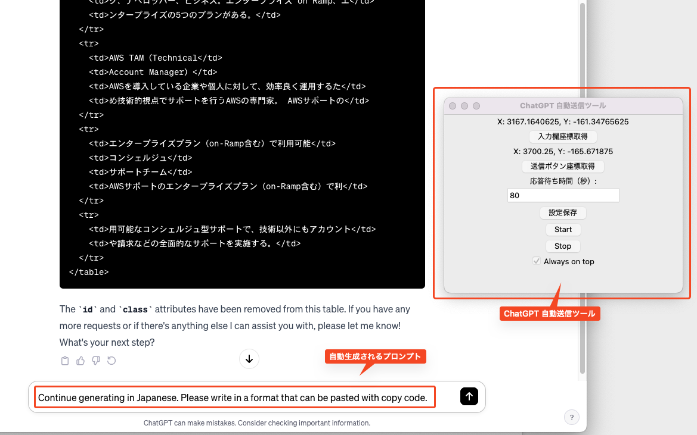

# ChatGPT Automatic Prompt Sending Tool

[Translate in Japanese](./README.md)



## Overview

This tool automatically sends the prompt "Continue generating in Japanese." It includes functionality to automatically click at specified coordinates, enter text, and send it.

## Environment

- macOS Monterey 12.6.7
- Python 3.11.6
- pipenv 2023.7.23

## Setup

Follow these steps to use this tool:

### Installing Required Libraries

1. Install Pipenv

```bash
pip install pipenv
```

```bash
pipenv install
```

## How To Use

0. Start the program.
   - Start command

```bash
pipenv run python main.py
```

1. Use the "Get Message Box Coordinates" button to get the coordinates of the message box.
1. Right-click to save the coordinates of the message box.
1. Use the "Get Send Button Coordinates" button to get the coordinates of the send button.
1. Right-click to save the coordinates of the send button.
1. Enter the waiting time for responses.
1. Save the settings with the "Save Settings" button.
1. Ensure the input is in half-width characters. (※ Full-width characters may prevent accurate entry of "Continue generating in Japanese.")
1. Press the "Start" button to start the program.
1. If necessary, you can stop the program by pressing the "Stop" button.

### Notes

- If the tool window does not appear on the screen, adjust the values in config.json (the configuration file for this tool window).
- If clicking on the message box or send button does not work well, adjust the clicking coordinates using the "Get Message Box Coordinates" and "Get Send Button Coordinates" buttons.
- This tool depends on the Chat GPT screen layout. If the window size changes, you may need to reset the message box and send button coordinates.
- Automated scripts can cause unexpected behavior. Please use at your own risk.
